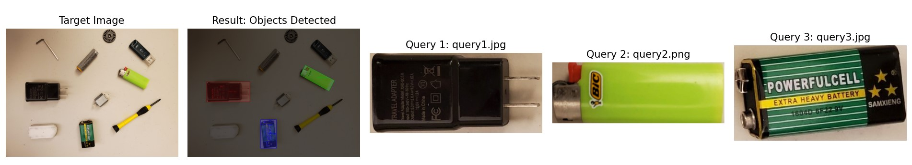

# Object-Detection-with-SIFT

This project provides tools for detecting objects in images and videos using SIFT (Scale-Invariant Feature Transform) feature matching. It includes both image-based and video-based detection capabilities.

## Features

- **Image Object Detection**: Detect multiple objects from query images within a target image
- **Video Object Detection**: Track an object through a video sequence
- **Multiple Object Support**: Detect and highlight multiple different objects simultaneously
- **Visualization**: Display results with bounding boxes and keypoints
- **Output Saving**: Save detection results as images or videos

## Requirements

- Python 3.6+
- OpenCV (with contrib modules for SIFT)
- NumPy
- Matplotlib (for visualization)

Install requirements with:
```bash
pip install opencv-contrib-python numpy matplotlib
```

## Installation

1. Clone this repository:
```bash
git clone https://github.com/mennanoseer/Object-Detection-with-SIFT.git
cd Object-Detection-with-SIFT
```

2. Install the required packages (see Requirements above)

## Usage

### Image Object Detection

```bash
python object_detection_image.py [query_images] [target_image] [options]

# Example:
python object_detection_image.py images/query1.jpg  images/query2.jpg target.jpg -o output.jpg
```

**Options:**
- `query_images`: Path to query image(s) or directory containing query images
- `target_image`: Path to target image where to search for objects
- `-o/--output`: Path to save the result image (optional)
- `-m/--min-matches`: Minimum number of good matches required (default: 10)
- `-n/--no-display`: Do not display the results (only save if output specified)

### Video Object Detection

```bash
python object_detection_video.py --query [query_image] --video [video_path] [options]

# Example:
python object_detection_video.py --query object.jpg --video input.mp4 --save
```

**Options:**
- `--query`: Path to query image containing the object to find
- `--video`: Path to video file to process
- `--min-matches`: Minimum good matches required (default: 10)
- `--scale`: Display scale factor (default: 1.0)
- `--ratio`: Lowe's ratio test threshold (default: 0.7)
- `--ransac`: RANSAC threshold for homography (default: 5.0)
- `--save`: Save output video (optional)

## Example Outputs

### 1. Multiple Object Detection
Detects several query objects in a target image simultaneously:


### 2. Single Object Detection
Detects one specific object in a target image:
 

### Video Detection
See the [videos folder](videos/) for example detection results in video format.

## Project Structure

```
object-detection-sift/
│
├── object_detection_image.py       # Main script for image detection
├── object_detection_video.py       # Main script for video detection
├── image_detector.py               # Core image detection logic
├── video_detector.py               # Core video detection logic
├── image_processor.py              # Image processing utilities
├── video_processor.py              # Video processing utilities
├── utils.py                        # Helper functions and validation
├── images/                         # images folder
├── videos/                         # videos folder
├── README.md                       # This file
└── requirements.txt                # Python dependencies
```
